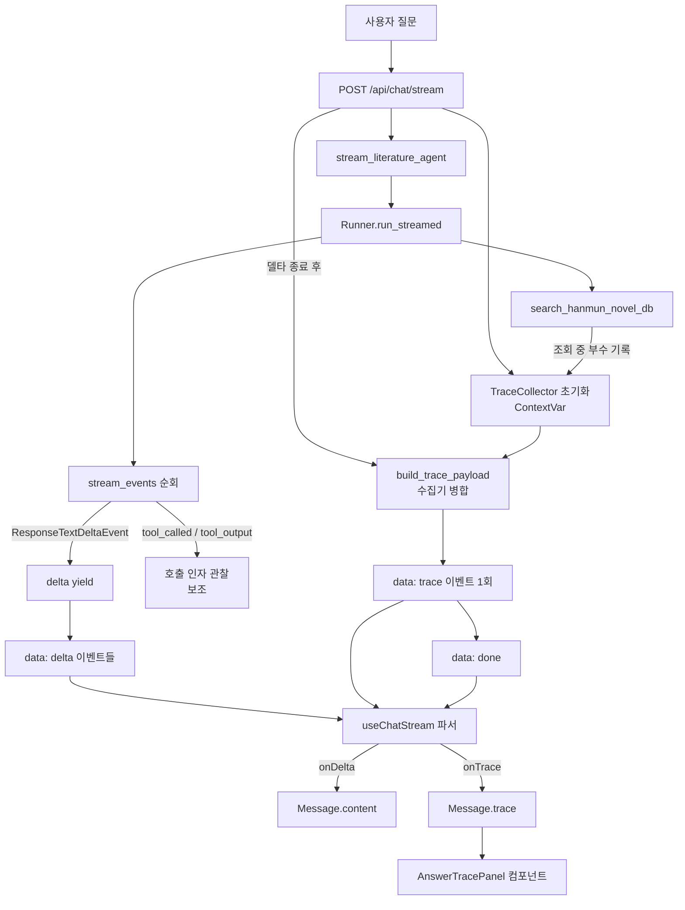
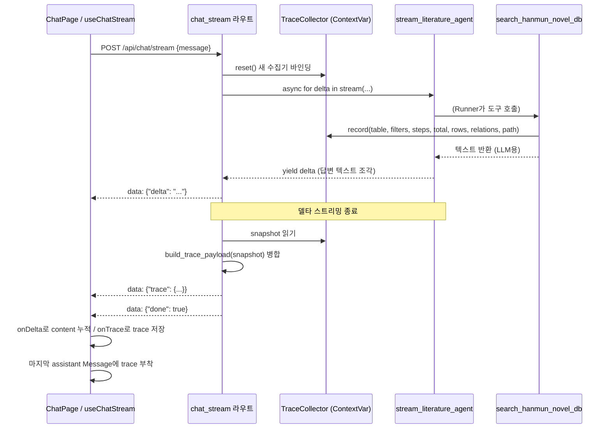

# Design Document: 답변 근거 패널 (answer-trace-panel)

## Overview

AI 질문(ChatPage)의 어시스턴트 답변 아래에 "왜 이런 답이 나왔지?" 토글 버튼을 두고, 누르면 답변 생성의 근거(trace)를 펼쳐 보여준다. 근거는 정적 목업이 아니라 실제 백엔드가 이번 질문을 처리하며 호출한 도구(`search_hanmun_novel_db`)의 호출 인자와 조회 결과에서 수집한 데이터로 채워진다. 시안 "ai-chat (1)"의 `answer-audit` 패널 디자인을 참고 기준으로 삼되, 시안의 Cypher 항목은 제외하고(실제 백엔드는 Neo4j가 아닌 SQLAlchemy+PostgreSQL) 시스템 구조에 맞게 5개 항목으로 구성한다.

근거 데이터는 기존 SSE 스트리밍 계약을 깨지 않는 방식으로 전달한다. 답변 텍스트 델타(`delta`) 스트리밍이 모두 끝난 뒤, `done` 직전에 `data: {"trace": {...}}` 이벤트를 한 번 더 흘려 근거 전체를 한꺼번에 내려보낸다. 한 질문에서 도구를 여러 번 호출한 경우 근거를 여러 개로 나열하지 않고 하나의 trace로 병합해 표시한다.

핵심 설계 결정은 "도구 호출 결과(레코드 표)를 어떻게 구조화 데이터로 확보할 것인가"이다. Agents SDK v0.22.0 조사 결과, 도구 호출 **인자**(table/filters/steps)는 스트림 이벤트에서 JSON으로 안정적으로 확보되지만, 도구 **반환값**은 사람이 읽는 텍스트 한 덩어리뿐이라 레코드 표를 채우기에 부적합하다. 따라서 이 설계는 도구가 텍스트와 함께 구조화된 근거를 남기도록 리팩터링하는 방향을 채택한다(아래 "설계 결정 1" 참조).

## 조사로 확정된 사실 (Agents SDK v0.22.0)

`backend/.venv`의 Python으로 실제 SDK를 조사해 다음을 확정했다.

- `result.stream_events()`는 `RunItemStreamEvent`(`type == "run_item_stream_event"`)를 내보내며, 도구 관련 이벤트의 `name`은 `"tool_called"`(도구 호출)과 `"tool_output"`(도구 결과)이다.
- `name == "tool_called"`일 때 `event.item`은 `ToolCallItem`이다.
  - `item.tool_name` → 도구 이름 (여기서는 `"search_hanmun_novel_db"`).
  - `item.call_id` → 호출 식별자.
  - `item.raw_item`는 `ResponseFunctionToolCall`이며 `.arguments`(JSON 문자열), `.name`, `.call_id` 필드를 가진다. `arguments`를 `json.loads`하면 `{table, filters, steps, include_relations, limit, ...}`를 얻는다.
- `name == "tool_output"`일 때 `event.item`은 `ToolCallOutputItem`이다.
  - `item.output` → 도구가 반환한 값(이 프로젝트에서는 사람이 읽는 **문자열**).
  - `item.call_id` → 대응하는 호출 식별자(같은 `call_id`로 호출 인자와 결과를 짝지을 수 있다).
  - `item.custom_data`(`dict | None`) → SDK 전용 부가 데이터 슬롯. 다만 순수 `@function_tool`은 문자열만 반환하므로 기본적으로 채워지지 않는다.
- `run_streamed`의 결과 객체(`RunResultStreaming`)에는 공개 `new_items` 속성이 노출되지 않으므로, 스트림 진행 중 `tool_called`/`tool_output` 이벤트를 관찰해 수집하는 방식이 신뢰할 수 있는 경로다.

결론: **호출 인자는 이벤트에서 안정 확보 가능하나, 조회된 실제 레코드는 도구가 스스로 구조화해 남기지 않으면 확보 불가**하다.

## 설계 결정

### 설계 결정 1: 도구가 구조화 근거를 남기게 리팩터링 (텍스트 파싱 대신)

**선택**: `search_hanmun_novel_db`가 LLM에 보낼 텍스트는 그대로 반환하되, 조회 과정에서 만든 구조화 데이터(조회 테이블, 적용 filters, steps, 총 건수, 표시 레코드 행, 관계 목록, 경로 목록)를 프로세스 로컬 수집기(collector)에 부수적으로 기록하게 한다.

**대안(기각)**: 도구가 반환한 텍스트를 백엔드에서 정규식으로 파싱해 표를 복원한다.

**근거**:
- 도구 반환 텍스트는 LLM 소비용으로 자유 형식이며(`_render`가 컬럼을 `", "`로 이어붙이고 장문은 `…(생략)` 처리), 파싱은 형식 변경에 취약하다.
- 도구는 이미 내부적으로 `total`, `rows`, `rel_map`, 경로(`paths`)를 계산한다. 이 값을 원천에서 그대로 넘기는 것이 정확하고 파싱보다 견고하다.
- LLM에 가는 텍스트 계약은 전혀 바뀌지 않으므로 답변 품질에 영향이 없다.

**수집 메커니즘**: `@function_tool` 함수는 반환값이 문자열로 고정되고 별도 채널이 없으므로, `contextvars.ContextVar`에 요청 단위 수집기를 두고 도구가 실행 중 append 하게 한다. `contextvars`는 asyncio 태스크 경계에서 안전하게 격리되므로 동시 요청이 서로의 근거를 섞지 않는다. 라우트(요청 핸들러)에서 수집기를 초기화하고, 스트리밍이 끝난 뒤 수집기 내용을 읽어 trace로 병합한다.

> 참고: `tool_called` 이벤트의 arguments로도 table/filters/steps를 얻을 수 있으나, 실제 조회된 레코드 행과 총 건수는 도구 내부에서만 알 수 있으므로 수집기 방식이 필수다. arguments 이벤트는 보조 검증용으로만 쓸 수 있고, 본 설계는 수집기를 단일 진실 원천으로 삼는다.

### 설계 결정 2: trace를 SSE 전용 이벤트로 done 직전에 1회 전송

**선택**: 기존 `delta`/`done`/`error` 이벤트 계약을 유지하고, 답변 델타가 모두 끝난 뒤 `done` 직전에 `data: {"trace": {...}}` 이벤트를 한 번만 추가한다.

**근거**: 근거 표는 답변이 완성된 뒤에야 전체가 확정되고(여러 도구 호출 병합), 스트리밍 도중 부분 전송은 프론트 상태 관리를 복잡하게 만든다. 단일 이벤트가 프론트/백엔드 모두 단순하고, `done` 이벤트 형식(불리언)도 그대로 유지된다.

### 설계 결정 3: 여러 도구 호출은 단일 trace로 병합

**선택**: 한 질문에서 `search_hanmun_novel_db`가 N번 호출되면, 모든 호출에서 수집된 노드(클래스)·관계·레코드·경로를 병합해 하나의 trace를 만든다.

**병합 규칙**:
- **클래스(노드)**: 조회에 등장한 모든 클래스를 합집합으로 모은다(중복 제거, 첫 등장 순서 유지).
- **관계**: 등장한 관계명을 합집합으로 모은다(중복 제거). `RELATION_KOR`로 한국어 병기.
- **레코드 표**: 클래스별로 레코드를 누적하되, 같은 클래스의 레코드는 `id` 기준으로 중복 제거하고, 클래스별 "전체 건수(total)"는 그 클래스를 조회한 호출들의 total 중 최댓값으로 표기한다(같은 클래스를 서로 다른 filters로 조회하면 total이 달라질 수 있어, 사용자에게 "적어도 이만큼 있다"는 보수적 상한을 제공).
- **경로(trace path)**: 각 호출의 경로 조각을 순서대로 이어 하나의 단계 목록(steps)으로 재구성한다. 단일 조회(steps 없음)만 있었다면 조회한 클래스 나열로 경로를 대체한다.
- **evidence 요약**: 클래스별 조회 건수 요약 문장 리스트로 생성(예: "이본(Book) 142건 중 30건 확인").

### 설계 결정 4: 색상 토큰은 프로젝트 Ghibli Meadow(하늘색)로 이식

시안 `answer-audit`의 navy/blue 계열 색은 프로젝트 디자인 토큰(`--green-*`은 실제 하늘색, `--sky`, `--border`, `--shadow`, `--font-title`)에 매핑한다. 스타일은 `frontend/src/styles/chat.css`의 `.home-root` 스코프 안에 추가한다. AGENTS.md 원칙(프로젝트 토큰 체계 유지, 한국어 원문 보존)을 따른다.

## Architecture



## Sequence Diagram



## Components and Interfaces

### Backend Component 1: TraceCollector (신규 모듈 `app/agents/trace.py`)

**Purpose**: 한 요청 동안 도구가 남기는 구조화 근거를 asyncio 태스크 격리하에 모은다.

**Interface** (Python):
```python
# 도구가 한 번 조회할 때마다 남기는 원본 기록
@dataclass
class ToolQueryRecord:
    table: str                       # 조회 시작 클래스 키 (예: "book")
    node_class: str                  # Edge 표기 클래스명 (예: "Book")
    filters: dict[str, str]
    steps: list[str] | None
    total: int                       # 조건에 맞는 전체 건수
    shown_rows: list[dict[str, str]] # 표시된 레코드 (컬럼→값), 장문은 축약
    relations: list[str]             # 등장한 관계명 (원문 키, 예: "spreadsInto")
    path_segments: list[str]         # 경로 탐색 시 단계 라벨들

# ContextVar 기반 요청 단위 수집기
class TraceCollector:
    def reset(self) -> None: ...            # 요청 시작 시 비운다
    def record(self, rec: ToolQueryRecord) -> None: ...
    def snapshot(self) -> list[ToolQueryRecord]: ...

def current_collector() -> TraceCollector: ...  # ContextVar에서 현재 수집기 획득
```

**Responsibilities**:
- 요청 단위로 기록을 격리 저장한다.
- 도구가 결과가 없거나 오류일 때는 기록하지 않거나 빈 결과로 기록한다.

### Backend Component 2: 도구 계측 (`app/agents/tools.py` 수정)

**Purpose**: `search_hanmun_novel_db`가 텍스트를 반환하기 직전, 계산해 둔 구조화 데이터를 `current_collector().record(...)`로 남긴다.

**Responsibilities**:
- 단일 조회 모드: `total`, `rows`(→`shown_rows`로 직렬화), `rel_map`(→`relations` 관계명 집합) 기록. `node_class = KEY_TO_CLASS[table]`.
- 경로 탐색 모드: 찾은 경로들을 `path_segments`로, 경로에 등장한 클래스/관계를 `relations`·클래스 목록으로 기록.
- 스키마 안내 모드(`schema_only`)와 오류 반환은 근거로 기록하지 않는다(사용자 질문의 실제 근거가 아님).
- LLM에 반환하는 텍스트 계약은 변경하지 않는다.

**행(row) 직렬화 규칙**: `shown_rows`는 각 레코드의 비어있지 않은 컬럼을 `{컬럼명: 값}`으로 담되, 장문 컬럼(`LONG_COLS`)은 120자로 축약한다(기존 `_render`의 brief 규칙과 동일한 상한). 프론트 미리보기 표가 과도하게 커지지 않도록 클래스당 표시 행 수는 도구의 `limit`(기본 30)을 따른다.

### Backend Component 3: trace 페이로드 빌더 (`app/agents/trace.py`)

**Purpose**: 수집된 여러 `ToolQueryRecord`를 설계 결정 3의 병합 규칙에 따라 단일 trace 페이로드로 만든다.

**Interface** (Python):
```python
def build_trace_payload(records: list[ToolQueryRecord]) -> dict | None:
    """여러 도구 호출 기록을 하나의 trace로 병합한다.
    기록이 없으면(도구를 안 썼으면) None을 반환한다."""
```

**출력 스키마** (JSON, SSE `trace` 이벤트 본문):
```json
{
  "path": ["작품", "이본", "외평"],
  "classes": [
    { "key": "abstract_work", "node_class": "AbstractWork", "label": "작품" },
    { "key": "book", "node_class": "Book", "label": "이본" },
    { "key": "review", "node_class": "Review", "label": "외평" }
  ],
  "relations": [
    { "name": "spreadsInto", "korean": "이본으로 확산된다" },
    { "name": "contains", "korean": "보유한다" }
  ],
  "evidence": [
    "작품(AbstractWork) 2건 확인",
    "이본(Book) 142건 중 30건 확인",
    "외평(Review) 46건 중 30건 확인"
  ],
  "records": [
    {
      "key": "book",
      "node_class": "Book",
      "label": "이본",
      "total": 142,
      "shown": 30,
      "columns": ["id", "title_name_kor", "institution_kor"],
      "rows": [
        { "id": "book_001", "title_name_kor": "...", "institution_kor": "..." }
      ]
    }
  ]
}
```

**Responsibilities**:
- 클래스/관계 합집합(중복 제거, 등장 순서 유지).
- 클래스별 레코드 `id` 중복 제거, `total`은 해당 클래스 조회들의 최댓값.
- `columns`는 그 클래스 레코드들에 등장한 컬럼의 합집합(등장 순서 유지); 각 `row`는 없는 컬럼을 생략(프론트에서 빈칸 처리).
- `path`는 병합된 경로 단계의 한국어 라벨 목록. 경로 탐색이 없으면 조회 클래스 라벨 나열.
- 라벨(`label`)은 클래스 한국어명 매핑표(예: `AbstractWork`→"작품", `Book`→"이본", `Review`→"외평")로 부여. 이 매핑은 `trace.py`에 상수로 둔다.

### Backend Component 4: 스트리밍 배선 (`literature_agent.py` + `chat.py` 수정)

**`stream_literature_agent`**: 반환 시그니처를 확장한다. 델타 문자열을 yield하는 것은 유지하되, 도구 호출 관찰은 수집기 방식이 이미 담당하므로 이 함수는 델타만 계속 yield한다(도구 이벤트를 별도 처리할 필요 없음). 라우트가 수집기 스냅샷을 읽는다.

**`chat_stream` 라우트**:
```python
async def event_source() -> AsyncIterator[str]:
    collector = current_collector()
    collector.reset()
    try:
        async for delta in stream_literature_agent(payload.message):
            yield sse({"delta": delta})
    except Exception as err:
        yield sse({"error": str(err)})
    else:
        trace = build_trace_payload(collector.snapshot())
        if trace is not None:
            yield sse({"trace": trace})
        yield sse({"done": True})
```
- `error` 발생 시에는 trace를 보내지 않는다(부분 근거의 혼란 방지).
- trace가 `None`(도구 미사용)이면 trace 이벤트를 생략하고 `done`만 보낸다.

### Frontend Component 5: useChatStream 확장 (`hooks/useChat.ts`)

**Purpose**: SSE 파서가 `trace` 이벤트를 인식하고 `onTrace` 콜백으로 넘긴다.

**Interface** (TypeScript):
```typescript
export interface TraceClass { key: string; node_class: string; label: string }
export interface TraceRelation { name: string; korean: string }
export interface TraceRecordGroup {
  key: string
  node_class: string
  label: string
  total: number
  shown: number
  columns: string[]
  rows: Record<string, string>[]
}
export interface AnswerTrace {
  path: string[]
  classes: TraceClass[]
  relations: TraceRelation[]
  evidence: string[]
  records: TraceRecordGroup[]
}

interface StreamCallbacks {
  onDelta: (delta: string) => void
  onTrace?: (trace: AnswerTrace) => void   // 신규 (선택)
}
```
- 파서 payload 타입에 `trace?: AnswerTrace` 추가. `payload.trace`가 오면 `onTrace?.(payload.trace)` 호출. `done`/`error`/`delta` 처리는 기존대로.

### Frontend Component 6: Message 타입 확장 + AnswerTracePanel 컴포넌트

**`Message` 타입** (`ChatPage.tsx`): `trace?: AnswerTrace` 필드 추가. `onTrace`에서 마지막 assistant 메시지에 `trace`를 부착한다.

**`AnswerTracePanel`** (신규 `components/chat/AnswerTracePanel.tsx`):
- Props: `{ trace: AnswerTrace }`.
- 어시스턴트 `.bubble` 안, 마크다운 아래에 렌더. `trace`가 없으면 아무것도 렌더하지 않는다(인사말·근거 없는 답변엔 패널 미표시).
- 구조(시안 answer-audit 참고, Cypher 제외):
  1. **why-button**: "왜 이런 답이 나왔지?" 토글 버튼. `aria-expanded`, `aria-controls`로 패널 연결. chevron 회전.
  2. **패널 헤더**: kicker "Answer trace" + "답변 생성 경로" 제목.
  3. **탐색 경로(trace path)**: `trace.path`를 단계 칩으로(예: 작품 → 이본 → 외평).
  4. **조회한 노드**: `trace.classes`를 클래스 칩으로(한국어 label + `node_class` 병기).
  5. **연결 관계**: `trace.relations`를 관계 칩으로(원문 관계명 + `korean` 병기).
  6. **답변 근거 요약**: `trace.evidence` 리스트.
  7. **관련 노드 테이블**: `trace.records`를 탭으로 클래스 전환, 각 탭에 "전체 N건 중 M건 미리보기" 표기 + `columns`/`rows` 표.
- 접근성: 토글·탭은 `<button>` 시맨틱, `aria-expanded`/`aria-controls`/`aria-selected`, 키보드 접근 가능.

### Frontend Component 7: 스타일 (`styles/chat.css`)

시안 `answer-audit` 스타일을 `.home-root` 스코프로 이식한다. 색상은 프로젝트 토큰(`--green-*`, `--sky`, `--border`, `--shadow`)으로 매핑, 제목류는 `--font-title`. `prefers-reduced-motion` 대응 및 반응형(≤620px에서 근거 3칸→1칸, 탭 가로 스크롤 등) 포함.

## Data Models

### AnswerTrace (SSE `trace` 이벤트 본문 / 프론트 상태)

| 필드 | 타입 | 설명 |
|------|------|------|
| `path` | `string[]` | 병합된 탐색 경로의 한국어 라벨 단계 |
| `classes` | `TraceClass[]` | 조회에 등장한 클래스(노드) 합집합 |
| `relations` | `TraceRelation[]` | 등장한 관계명 합집합(한국어 병기) |
| `evidence` | `string[]` | 클래스별 조회 건수 요약 문장 |
| `records` | `TraceRecordGroup[]` | 클래스별 레코드 미리보기 표 데이터 |

**Validation Rules**:
- `path`, `classes`, `relations`, `evidence`, `records`는 배열이며 비어 있을 수 있다(단, 최소 한 클래스는 조회되었을 때만 trace 자체가 생성됨).
- `TraceRecordGroup.shown == rows.length`, `shown <= total`.
- `rows`의 각 객체 키는 `columns`의 부분집합.
- `TraceClass.node_class`는 `CLASS_TO_KEY`의 유효 클래스명, `key`는 `MODELS`의 유효 키.

## Correctness Properties

*속성(property)은 시스템의 모든 유효한 실행에서 성립해야 하는 특성·동작으로, 사람이 읽는 명세와 기계가 검증 가능한 정확성 보증 사이를 잇는 형식적 진술이다.*

각 속성은 requirements.md의 조항을 검증한다. 아래 속성들은 prework 분석에서 PROPERTY로 분류된 조항들만 대상으로 하며, EXAMPLE·EDGE_CASE·INTEGRATION·SMOKE로 분류된 조항은 단위/예제/통합 테스트로 다룬다(Testing Strategy 참조).

### Property 1: 행 직렬화 무결성

*For any* 레코드(컬럼→값 매핑)에 대해, 도구가 남기는 `shown_rows`의 각 항목은 값이 비어있지 않은 컬럼만 포함하고, 장문 컬럼(`LONG_COLS`)의 값 길이는 120자 이하이다.

**Validates: Requirements 1.6**

### Property 2: 동시 요청 근거 격리

*For any* 동시에 실행되는 asyncio 태스크 집합에 대해, 각 태스크가 자신의 Trace_Collector 에 기록한 뒤 읽은 스냅샷은 오직 그 태스크가 기록한 항목만 포함하고 다른 태스크의 기록을 포함하지 않는다.

**Validates: Requirements 2.2**

### Property 3: 스냅샷 순서 보존

*For any* Trace_Collector 에 기록한 Tool_Query_Record 시퀀스에 대해, `snapshot()`이 반환하는 목록은 기록한 순서와 동일한 순서로 같은 항목들을 담는다.

**Validates: Requirements 2.3**

### Property 4: 클래스 합집합(순서 유지·중복 제거)

*For any* Tool_Query_Record 목록에 대해, 병합 결과의 `classes`는 등장한 모든 클래스를 첫 등장 순서를 유지한 채 담고, 같은 `node_class`가 중복해서 나타나지 않는다.

**Validates: Requirements 3.1**

### Property 5: 관계 합집합(순서 유지·중복 제거)

*For any* Tool_Query_Record 목록에 대해, 병합 결과의 `relations`는 등장한 모든 관계명을 첫 등장 순서를 유지한 채 담고, 같은 `name`이 중복해서 나타나지 않는다.

**Validates: Requirements 3.2**

### Property 6: 클래스별 레코드 id 중복 제거

*For any* Tool_Query_Record 목록에 대해, 병합 결과의 각 Trace_Record_Group 의 `rows`에서 `id` 값은 유일하다(같은 id 가 두 번 나타나지 않는다).

**Validates: Requirements 3.3**

### Property 7: 클래스별 total 최댓값

*For any* 같은 클래스를 서로 다른 total 로 조회한 Tool_Query_Record 목록에 대해, 병합 결과의 해당 Trace_Record_Group 의 `total`은 그 클래스를 조회한 기록들의 total 중 최댓값과 같다.

**Validates: Requirements 3.4**

### Property 8: columns 합집합과 row 키 포함 관계

*For any* Tool_Query_Record 목록에 대해, 각 Trace_Record_Group 의 `columns`는 그 그룹 레코드들에 등장한 컬럼을 첫 등장 순서를 유지한 합집합으로 담고, 모든 `row`의 키는 그 그룹 `columns`의 부분집합이다.

**Validates: Requirements 3.5**

### Property 9: 경로 부재 시 클래스 라벨 나열

*For any* 경로 탐색 단계(`path_segments`)가 없는 Tool_Query_Record 목록에 대해, 병합 결과의 `path`는 병합된 `classes`의 한국어 `label` 나열과 같다.

**Validates: Requirements 3.7**

### Property 10: 클래스별 evidence 대응

*For any* 하나 이상의 클래스를 가진 Tool_Query_Record 목록에 대해, 병합 결과의 각 클래스마다 대응하는 조회 건수 요약 문장이 `evidence` 목록에 존재한다.

**Validates: Requirements 3.8**

### Property 11: 파서 견고성(trace 무관 본문 처리)

*For any* `delta`/`done`/`error` 이벤트 시퀀스에 대해, 그 사이에 유효하거나 스키마가 어긋난 `trace` 이벤트를 섞어 넣어도, Chat_Stream_Parser 가 조립한 최종 답변 텍스트와 `done`/`error` 처리 결과는 trace 이벤트가 없을 때와 동일하다.

**Validates: Requirements 5.3**

### Property 12: 근거 버튼 존재 ⇔ trace 존재

*For any* assistant 메시지에 대해, Answer_Trace_Panel 이 "왜 이런 답이 나왔지?" 버튼과 패널을 렌더하는 것은 그 메시지에 Answer_Trace 가 부착되어 있는 경우이고 오직 그 경우뿐이다.

**Validates: Requirements 6.2, 7.1**

### Property 13: 노드 칩의 label·node_class 병기

*For any* Answer_Trace 의 `classes`에 대해, 렌더된 각 클래스 칩은 그 클래스의 한국어 `label`과 `node_class` 텍스트를 모두 포함한다.

**Validates: Requirements 7.5**

### Property 14: 관계 칩의 원문명·한국어 병기

*For any* Answer_Trace 의 `relations`에 대해, 렌더된 각 관계 칩은 그 관계의 원문 `name`과 한국어 `korean` 텍스트를 모두 포함한다.

**Validates: Requirements 7.6**

### Property 15: 클래스별 탭 대응

*For any* Answer_Trace 의 `records`에 대해, 렌더된 클래스 탭의 개수는 `records`의 Trace_Record_Group 개수와 같고, 각 탭은 대응하는 클래스에 매핑된다.

**Validates: Requirements 8.1**

### Property 16: 미리보기 건수 표기 정확성

*For any* Trace_Record_Group 에 대해, 렌더된 "전체 N건 중 M건 미리보기" 표기의 N 은 그 그룹의 `total`, M 은 `shown`과 정확히 일치한다.

**Validates: Requirements 8.3**

### Property 17: 셀 값 렌더 무결성

*For any* 마크다운/HTML 마커 또는 한국어 원문을 포함하는 셀 값에 대해, Answer_Trace_Panel 은 값을 원문 텍스트 그대로 표시하고 마크다운·HTML 로 해석해 요소를 생성하지 않는다.

**Validates: Requirements 8.4, 10.3**

### Property 18: 토글 aria 상태 일치

*For any* 근거 토글의 상태 전환 시퀀스에 대해, 토글 버튼의 `aria-expanded` 값은 패널의 실제 펼침 상태와 항상 일치하고, `aria-controls`는 그 패널의 id 를 가리킨다.

**Validates: Requirements 9.2**

### Property 19: 선택 탭 aria-selected 배타성

*For any* 관련 노드 테이블의 탭 선택에 대해, 선택된 탭만 `aria-selected`가 true 이고 나머지 탭은 모두 false 이다.

**Validates: Requirements 9.3**

## Error Handling

### Error Scenario 1: 에이전트 실행 중 예외
**Condition**: `stream_literature_agent` 순회 중 예외.
**Response**: 기존대로 `data: {"error": ...}` 전송. trace 이벤트는 보내지 않는다.
**Recovery**: 프론트는 기존 로직대로 빈 assistant 메시지를 제거하고 오류 배너 표시.

### Error Scenario 2: 도구 미사용(고전문학 무관 질문 등)
**Condition**: 에이전트가 `search_hanmun_novel_db`를 한 번도 호출하지 않음.
**Response**: 수집기 스냅샷이 비어 `build_trace_payload`가 `None` 반환 → trace 이벤트 생략, `done`만 전송.
**Recovery**: 프론트는 `trace`가 없는 메시지에 대해 "왜 이런 답이 나왔지?" 버튼/패널을 렌더하지 않는다.

### Error Scenario 3: trace JSON 파싱 실패(프론트)
**Condition**: `trace` 이벤트 본문이 예상 스키마와 다름.
**Response**: 파서는 해당 이벤트를 무시(onTrace 미호출)하고 답변 표시는 정상 진행.
**Recovery**: 근거 패널만 표시되지 않고 답변 본문은 영향 없음.

### Error Scenario 4: 동시 요청 간 근거 혼선
**Condition**: 여러 사용자/요청이 동시에 스트리밍.
**Response**: `contextvars.ContextVar`가 asyncio 태스크별로 수집기를 격리해 서로의 기록이 섞이지 않는다.
**Recovery**: 요청 시작 시 `reset()`으로 항상 깨끗한 상태에서 시작.

## Testing Strategy

### Unit Testing Approach
- `build_trace_payload`: 단일 호출/다중 호출 병합, 클래스·관계 중복 제거, total 최댓값 규칙, 경로 재구성, 빈 입력→`None`을 예제 기반으로 검증.
- 도구 계측: 단일 조회/경로 탐색/무결과/오류/schema_only 각각에서 수집기 기록 여부와 내용을 검증(SessionLocal은 테스트 DB 또는 목).
- 프론트 파서: `trace` 이벤트를 포함한 SSE 바이트 스트림을 넣어 `onTrace`가 올바른 객체로 호출되는지, 기존 `delta`/`done`/`error` 동작이 유지되는지 검증.
- 컴포넌트: `AnswerTracePanel`이 trace 유무에 따라 렌더/미렌더, 토글 `aria-expanded`, 탭 전환, "전체 N건 중 M건" 표기를 검증.

### Property-Based Testing Approach
- 병합의 대수적 성질(합집합의 멱등성·교환성 유사 성질, total 상한 유지)과 SSE 라운드트립(직렬화→파싱 시 trace 동등) 등이 후보. 구체 속성은 Correctness Properties 확정 후 tasks에서 property 서브태스크로 배치.
- **Property Test Library**: 백엔드 `hypothesis`(pytest), 프론트 `fast-check`(vitest) — 도입 여부는 tasks 단계에서 기존 테스트 스택 확인 후 결정.

### Integration Testing Approach
- 실제 LLM 호출은 비용/비결정성으로 통합 테스트에서 제외. 라우트 레벨은 에이전트/수집기를 목으로 대체해 `delta…→trace→done` 이벤트 순서를 검증.

## Performance Considerations
- trace는 답변당 1회 전송이며 레코드는 클래스별 `limit`(기본 30)으로 상한이 있어 페이로드 크기가 제한적이다.
- 장문 컬럼은 120자로 축약해 전송량을 줄인다.

## Security Considerations
- trace에 담기는 데이터는 이미 공개 조회 도구가 반환하는 것과 동일 범위이므로 새로운 노출은 없다.
- 사용자 입력은 trace에 반영되지 않으므로 XSS 표면 증가 없음. 프론트는 표 값을 텍스트로만 렌더(마크다운/HTML 해석 금지)한다.

## Dependencies
- 기존: FastAPI, SQLAlchemy, OpenAI Agents SDK v0.22.0(백엔드); React 19, react-markdown, remark-gfm(프론트).
- 신규 런타임 의존성 없음. 테스트 단계에서 `hypothesis`/`fast-check` 도입 가능성만 검토.
